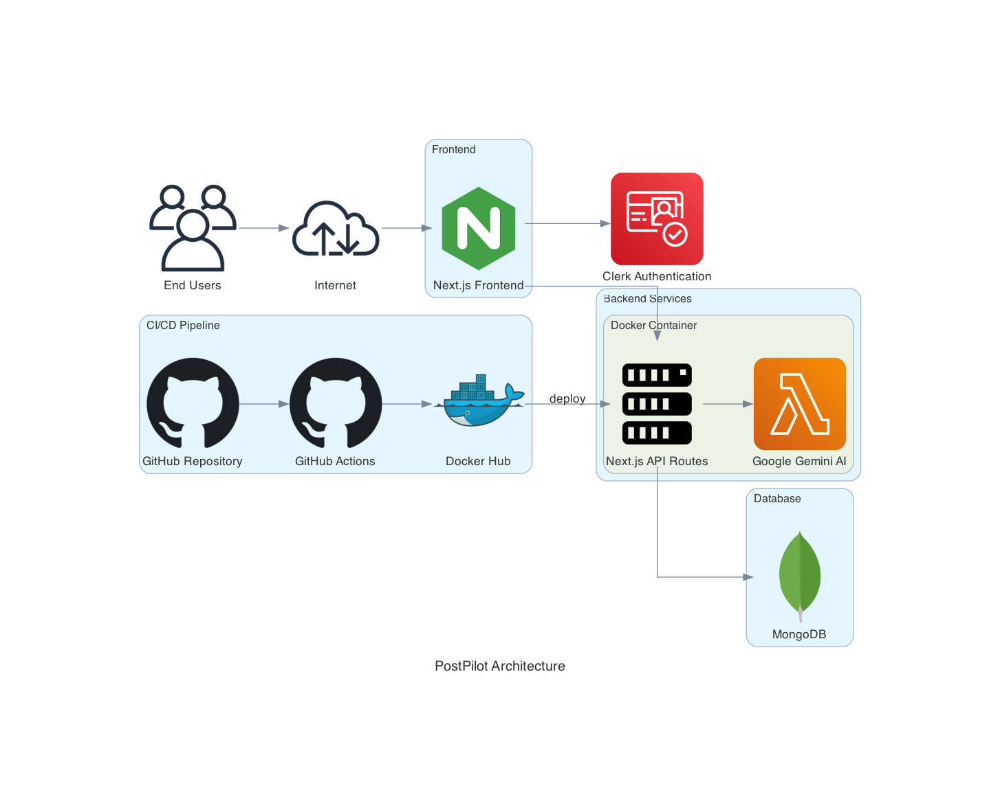

# PostPilot


PostPilot is an AI-powered platform for generating social media content. Users can ask for content ideas, get post suggestions, and manage their content creation workflow.

## Architecture



PostPilot follows a modern architecture with containerized deployment:
- Next.js frontend with Clerk authentication
- Next.js API routes for backend services
- Google Gemini AI for content generation
- MongoDB for data storage
- Docker for containerization
- GitHub Actions for CI/CD

For more details, see the [Architecture Documentation](./docs/architecture.md).

## Features

- AI-powered content generation for social media
- Chat history to review previous conversations
- Content suggestions for different platforms (Twitter, Instagram, LinkedIn)
- User-friendly interface with real-time responses
- User authentication with Clerk

## Getting Started

### Prerequisites

- Node.js 18+ and npm
- MongoDB database
- Clerk account for authentication
- Google Gemini API key

### Installation

1. Clone the repository
2. Install dependencies:

```bash
npm install --legacy-peer-deps
```

3. Set up environment variables in `.env`:

```
MONGODB_URI=your_mongodb_connection_string
GEMINI_API_KEY=your_gemini_api_key
NEXT_PUBLIC_CLERK_PUBLISHABLE_KEY=your_clerk_publishable_key
CLERK_SECRET_KEY=your_clerk_secret_key
```

4. Run the development server:

```bash
npm run dev
```

5. Open [http://localhost:3000](http://localhost:3000) in your browser.

## Docker Setup

You can also run PostPilot using Docker:

```bash
# Build the Docker images
docker-compose build

# Start the containers
docker-compose up -d
```

## CI/CD Pipeline

This project uses GitHub Actions for CI/CD:

1. **Build**: Builds the application on pushes to main
2. **Docker Build and Push**: Builds and pushes Docker image to Docker Hub
3. **Deploy to Staging**: Automatically deploys to staging environment
4. **Deploy to Production**: Deploys to production after approval

## Project Structure

```
postpilot/
├── app/
│   ├── api/
│   │   ├── chat/
│   │   │   ├── [id]/
│   │   │   ├── history/
│   │   │   └── route.ts
│   │   └── chats/
│   ├── page.tsx
│   ├── sign-in/
│   ├── sign-up/
│   └── layout.tsx
├── lib/
│   ├── api.ts
│   ├── gemini.ts
│   ├── mongodb.ts
│   └── utils.ts
├── models/
│   └── Chat.ts
├── components/
│   └── ErrorBoundary.tsx
├── docs/
│   ├── architecture.md
│   └── architecture-diagram.png
├── .github/
│   └── workflows/
│       ├── ci-cd.yml
│       ├── docker-publish.yml
│       └── deploy.yml
├── Dockerfile
└── docker-compose.yml
```

## DevOps Features

- **Containerization**: Docker for consistent environments
- **CI/CD**: Automated workflows with GitHub Actions
- **Container Registry**: Docker Hub for image storage
- **Deployment**: Automated deployment to staging and production
- **Security Scanning**: CodeQL for vulnerability detection

## Contributing

1. Fork the repository
2. Create your feature branch (`git checkout -b feature/amazing-feature`)
3. Commit your changes (`git commit -m 'Add some amazing feature'`)
4. Push to the branch (`git push origin feature/amazing-feature`)
5. Open a Pull Request

## License

This project is licensed under the MIT License
