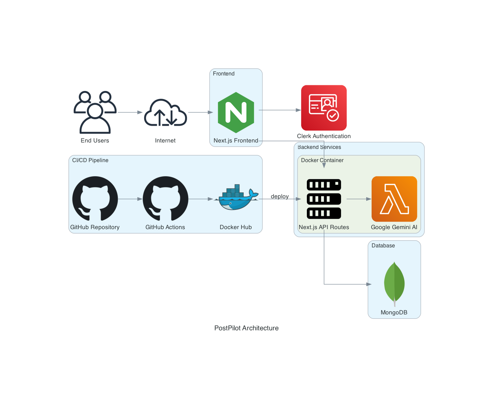

# PostPilot Architecture

## Overview

PostPilot is an AI-powered social media content generation platform built with Next.js, MongoDB, and Google Gemini AI. The application follows a modern architecture pattern with containerized deployment using Docker and CI/CD automation through GitHub Actions.

## Architecture Diagram

## Key Components

### Frontend
- **Next.js Application**: Server-side rendered React application providing the user interface
- **Tailwind CSS**: Utility-first CSS framework for styling
- **Clerk Authentication**: Secure user authentication and management

### Backend
- **Next.js API Routes**: API endpoints for handling requests
- **Google Gemini API**: AI service for generating social media content
- **MongoDB**: NoSQL database for storing user data and chat history

### DevOps
- **Docker**: Containerization for consistent deployment
- **GitHub Actions**: CI/CD pipeline for automated testing, building, and deployment
- **Docker Hub**: Container registry for storing Docker images

## Data Flow

1. Users authenticate through Clerk Authentication
2. Frontend sends requests to Next.js API routes
3. API routes process requests and interact with the database
4. For content generation, requests are sent to Google Gemini API
5. Results are stored in MongoDB and returned to the frontend
6. Frontend displays the results to the user

## Deployment Architecture

### Development Environment
- Local Docker containers for development
- MongoDB running locally or in a container

### Staging Environment
- Docker containers deployed to staging server
- MongoDB deployed as a container
- Automated deployment through GitHub Actions

### Production Environment
- Docker containers deployed to production server
- MongoDB with replication for high availability
- Automated deployment with approval process

## Security Considerations

- Clerk Authentication for secure user management
- Environment variables for sensitive configuration
- HTTPS for all communications
- Docker containers with minimal permissions
- Regular security scanning with CodeQL

## Scalability

- Horizontal scaling of Next.js containers
- MongoDB sharding for database scaling
- CDN for static asset delivery
- Docker containers for easy scaling

## Monitoring and Logging

- Application logs collected and centralized
- Performance monitoring for API endpoints
- Database monitoring for query performance
- Error tracking and alerting
